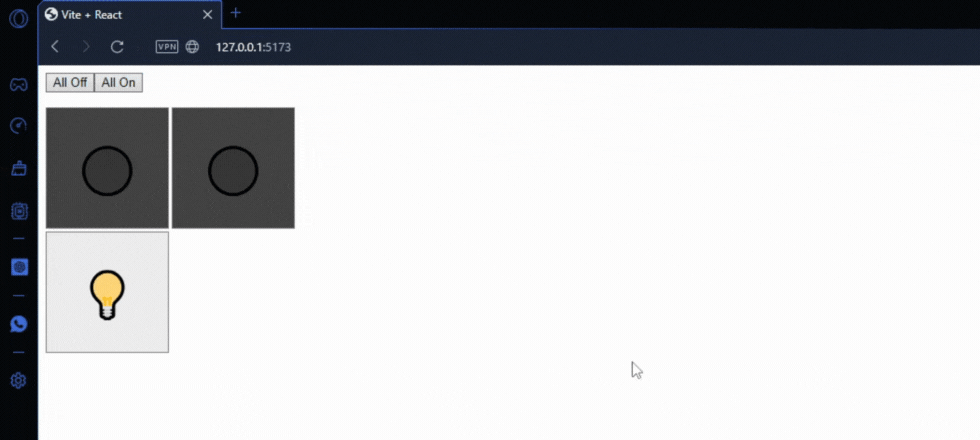

# Smart Home: Light Control - React Hooks

This project simulates a "smart home", empowering users to manage lights in different rooms through an interactive dashboard. Developed with ReactJS, this application showcases the use of useReducer and useContext hooks to handle the light state, delivering an efficient and user-friendly experience.

### Prerequisites

To use this application, you need to have knowledge of:

+ Node.js - Runtime environment for JavaScript.
+ ReactJS - JavaScript library for building interactive and reactive user interfaces.

### Installing and Running the Project

To download this project, run the following command down below.

```
git clone https://github.com/JuanPablo70/SmartHomeReact.git
```

Once the project is downloaded, open it in your favorite code editor such as VSCode and execute the following commands in the terminal:

```
npm install

npm run dev
```

In a web browser, visit the link [SmartHomeReact](http://127.0.0.1:5173/) to view the project.

### Project Functionality



Users can turn lights on or off in specific rooms using individual buttons or control all lights at once with a global button.

The **useReducer** hook is employed to manage the light state, enabling smooth and controlled transitions between on and off states.

The **useContext** hook is utilized to provide access to the global light state throughout the application, simplifying its usage across different components avoiding prop drilling.

### Build With

+ [Vite](https://vitejs.dev) - Next Generation Frontend Tooling
+ [React](https://es.react.dev) - The library for web and native user interfaces

### Version

1.0

### Author

[JuanPablo70](https://github.com/JuanPablo70)
